# Arquitetura da Plataforma de Gestão para Grupos de Networking

## Sumário

1. [Visão Geral](#visão-geral)
2. [Diagrama da Arquitetura](#diagrama-da-arquitetura)

---

## Visão Geral

Esta plataforma foi projetada para digitalizar a gestão de grupos de networking, substituindo planilhas e controles manuais por um sistema centralizado. A arquitetura adota uma abordagem fullstack moderna utilizando Next.js, que combina SSR (Server-Side Rendering), CSR (Client-Side Rendering) e API Routes em um único framework.

### Princípios Arquiteturais

- **Monolito Modular**: Aplicação Next.js única com separação clara de responsabilidades
- **API-First**: Endpoints REST bem definidos para todas as operações
- **Component-Driven**: Interface construída com componentes React reutilizáveis
- **Type-Safe**: TypeScript em toda a aplicação
- **Database-Agnostic**: Drizzle ORM para facilitar migração entre bancos de dados

---

## Diagrama da Arquitetura

