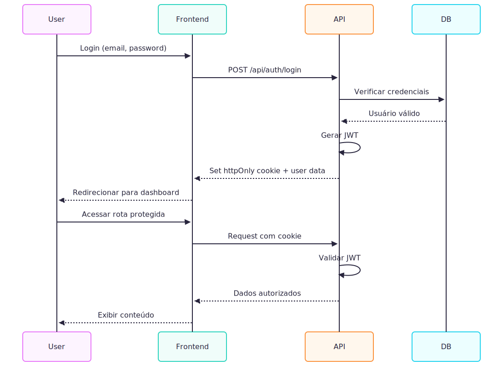

# Arquitetura da Plataforma de Gestão para Grupos de Networking

## Sumário

1. [Visão Geral](#visão-geral)
2. [Diagrama da Arquitetura](#diagrama-da-arquitetura)
3. [Stack Tecnológica](#stack-tecnológica)
4. [Modelo de Dados (Prisma ORM)](#modelo-de-dados-prisma-orm)
5. [Estrutura de Componentes (Frontend)](#estrutura-de-componentes-frontend)
6. [Definição da API](#definição-da-api)
7. [Autenticação e Autorização](#autenticação-e-autorização)
8. [Fluxos Principais](#fluxos-principais)
9. [Considerações de Segurança](#considerações-de-segurança)

---

## Visão Geral

Esta plataforma foi projetada para digitalizar a gestão de grupos de networking, substituindo planilhas e controles manuais por um sistema centralizado. A arquitetura adota uma abordagem fullstack moderna utilizando Next.js, que combina SSR (Server-Side Rendering), CSR (Client-Side Rendering) e API Routes em um único framework.

### Princípios Arquiteturais

- **Monolito Modular**: Aplicação Next.js única com separação clara de responsabilidades
- **API-First**: Endpoints REST bem definidos para todas as operações
- **Component-Driven**: Interface construída com componentes React reutilizáveis
- **Type-Safe**: TypeScript em toda a aplicação
- **Database-Agnostic**: Prisma ORM para facilitar migração entre bancos de dados

---

## Diagrama da Arquitetura


### Fluxo de Dados Simplificado


## Stack Tecnológica

### 🖥️ **Frontend**

| Tecnologia          | Resumo                                                                                                          | Justificativa                                                                                                             |
| ------------------- | --------------------------------------------------------------------------------------------------------------- | ------------------------------------------------------------------------------------------------------------------------- |
| **Next.js 16+ & React 19+**     | Framework React com suporte a SSR (Server-Side Rendering), SSG (Static Site Generation) e rotas de API nativas. | Permite criar aplicações fullstack performáticas e escaláveis, com renderização híbrida e excelente integração com React. |
| **TypeScript**      | Superset do JavaScript com tipagem estática.                                                                    | Permite uso de tipagem, aumentando a segurança e confiabilidade do código. |                               
| **Shadcn/ui com TailwindCSS 4+**       | Biblioteca de componentes acessíveis e personalizáveis.                                                         | Fornece UI consistente e moderna, permitindo um Design System melhorado e maior agilidade para estilização com o TailwindCSS.                                    |
| **React Hook Form** | Gerenciador de formulários baseado em hooks.                                                                    | Melhora a performance e reduz re-renderizações, integrando-se facilmente a libs como Zod.                                 |
| **Zod**             | Biblioteca de validação de schemas e tipagem runtime.                                                           | Garante integridade de dados e validação alinhada com os tipos TypeScript.                                                |

---

### ⚙️ **Backend**

| Tecnologia             | Resumo                                        | Justificativa                                                                                           |
| ---------------------- | --------------------------------------------- | ------------------------------------------------------------------------------------------------------- |
| **Next.js API Routes** | Rotas de API integradas ao framework Next.js. | Permite implementar endpoints REST diretamente no mesmo projeto, simplificando o deploy e a integração. |
| **Prisma ORM**        | ORM moderno “TypeScript-first”.               | Schema declarativo e intuitivo, migrações automáticas, Prisma Client totalmente tipado e fácil migração entre bancos de dados (SQLite, PostgreSQL, MySQL). |
| **SQLite**             | Banco de dados relacional leve em arquivo único.               | Ideal para desenvolvimento e testes. Com Prisma, migração para PostgreSQL ou MySQL é trivial, bastando alterar o provider no schema.                |
| **JWT (jsonwebtoken)** | Implementação de autenticação stateless.      | Facilita a autenticação distribuída, dispensando sessão persistente no servidor.                        |
| **bcrypt**             | Biblioteca para hash e verificação de senhas. | Garante segurança ao armazenar senhas de forma criptograficamente segura.                              

---

### 🧪 **Testes**

| Tecnologia                    | Resumo                                                   | Justificativa                                                              |
| ----------------------------- | -------------------------------------------------------- | -------------------------------------------------------------------------- |
| **Jest**                      | Framework completo de testes para JavaScript/TypeScript. | Fornece ambiente unificado para testes unitários e de integração.          |
| **React Testing Library**     | Utilitário para testes de componentes React.             | Foca no comportamento do usuário final, com testes de render e user actions. |
| **MSW (Mock Service Worker)** | Mock de requisições HTTP e interceptador de APIs.        | Permite testar o frontend sem depender de um backend real.                 |
| **Supertest**                 | Biblioteca para testar endpoints HTTP.                   | Ideal para validar APIs criadas com Next.js ou Express.                    |

---

### 🛠️ **Ferramentas**

| Tecnologia      | Resumo                                              | Justificativa                                                                          |
| --------------- | --------------------------------------------------- | -------------------------------------------------------------------------------------- |
| **Biome**       | Linter e formatador all-in-one ultrarrápido (escrito em Rust). | Substitui ESLint + Prettier com performance superior (até 25x mais rápido), configuração zero/mínima e menor footprint de dependências. Suporta JavaScript, TypeScript, JSON e JSX/TSX. |
| **Husky**       | Executor de Git hooks.                              | Automatiza checagens antes de commits/push, prevenindo código quebrado no repositório. |
| **Lint-staged** | Executa validações apenas nos arquivos modificados. | Otimiza o tempo de execução dos hooks, focando apenas em códigos alterados, tornando o fluxo de commits mais ágil.          |

---


## Modelo de Dados (Prisma ORM)

### Diagrama de Relacionamentos (ER Diagram)



---

### Tabelas Principais

**🔐 Core (Autenticação e Membros)**
- `User` - Usuários do sistema (admin/member)
- `Application` - Intenções de participação
- `MemberProfile` - Perfil completo dos membros

**📢 Comunicação e Engajamento**
- `Announcement` - Avisos e comunicados
- `Meeting` - Reuniões do grupo
- `MeetingAttendance` - Controle de presença

**💼 Negócios**
- `Referral` - Indicações de negócios
- `ReferralUpdate` - Histórico de status
- `ThankYou` - Agradecimentos públicos
- `OneOnOneMeeting` - Reuniões 1-a-1

**💰 Financeiro**
- `Membership` - Planos de mensalidade
- `Payment` - Pagamentos

---

<details>
<summary>📋 <strong>Schema Completo Prisma ORM (clique para expandir)</strong></summary>

```prisma
// schema.prisma

generator client {
  provider = "prisma-client-js"
}

datasource db {
  provider = "sqlite"
  url      = env("DATABASE_URL")
  
  // Provider para PostgreSQL para produção
  // provider = "postgresql"
  // url      = env("DATABASE_URL")
  
  // MySQL/MariaDB como alternativa ao PostgreSQL
  // provider = "mysql"
  // url      = env("DATABASE_URL")
}

// ========================================
// ENUMS
// ========================================

enum Role {
  ADMIN
  MEMBER
}

enum UserStatus {
  ACTIVE
  INACTIVE
  SUSPENDED
}

enum ApplicationStatus {
  PENDING
  APPROVED
  REJECTED
}

enum Priority {
  LOW
  NORMAL
  HIGH
  URGENT
}

enum TargetAudience {
  ALL
  MEMBERS
  ADMINS
}

enum MeetingType {
  REGULAR
  SPECIAL
  ONE_ON_ONE
}

enum MeetingStatus {
  SCHEDULED
  ONGOING
  COMPLETED
  CANCELLED
}

enum AttendanceStatus {
  PRESENT
  ABSENT
  EXCUSED
  LATE
}

enum ReferralStatus {
  SENT
  CONTACTED
  NEGOTIATING
  CLOSED_WON
  CLOSED_LOST
}

enum OneOnOneStatus {
  SCHEDULED
  COMPLETED
  CANCELLED
}

enum PlanType {
  MONTHLY
  QUARTERLY
  ANNUAL
}

enum MembershipStatus {
  ACTIVE
  CANCELLED
  SUSPENDED
}

enum PaymentStatus {
  PENDING
  PAID
  OVERDUE
  CANCELLED
}

// ========================================
// CORE MODELS
// ========================================

model User {
  id           String     @id @default(uuid())
  email        String     @unique
  passwordHash String     @map("password_hash")
  name         String
  role         Role       @default(MEMBER)
  status       UserStatus @default(ACTIVE)
  createdAt    DateTime   @default(now()) @map("created_at")
  updatedAt    DateTime   @updatedAt @map("updated_at")

  // Relations
  profile               MemberProfile?
  reviewedApplications  Application[]        @relation("ApplicationReviewer")
  announcements         Announcement[]
  createdMeetings       Meeting[]
  attendances           MeetingAttendance[]
  sentReferrals         Referral[]           @relation("ReferralSender")
  receivedReferrals     Referral[]           @relation("ReferralReceiver")
  referralUpdates       ReferralUpdate[]
  givenThankYous        ThankYou[]           @relation("ThankYouSender")
  receivedThankYous     ThankYou[]           @relation("ThankYouReceiver")
  oneOnOneMeetingsAsOne OneOnOneMeeting[]    @relation("MemberOne")
  oneOnOneMeetingsAsTwo OneOnOneMeeting[]    @relation("MemberTwo")
  memberships           Membership[]
  payments              Payment[]

  @@index([email])
  @@index([role])
  @@map("users")
}

model Application {
  id             String            @id @default(uuid())
  name           String
  email          String
  company        String
  motivation     String
  status         ApplicationStatus @default(PENDING)
  reviewedBy     String?           @map("reviewed_by")
  reviewedAt     DateTime?         @map("reviewed_at")
  token          String?           @unique
  tokenExpiresAt DateTime?         @map("token_expires_at")
  createdAt      DateTime          @default(now()) @map("created_at")
  updatedAt      DateTime          @updatedAt @map("updated_at")

  // Relations
  reviewer User?          @relation("ApplicationReviewer", fields: [reviewedBy], references: [id])
  profile  MemberProfile?

  @@index([status])
  @@index([email])
  @@map("applications")
}

model MemberProfile {
  id                 String   @id @default(uuid())
  userId             String   @unique @map("user_id")
  applicationId      String?  @map("application_id")
  phone              String?
  company            String
  position           String?
  companyDescription String?  @map("company_description")
  expertiseArea      String?  @map("expertise_area")
  linkedinUrl        String?  @map("linkedin_url")
  websiteUrl         String?  @map("website_url")
  profileImageUrl    String?  @map("profile_image_url")
  bio                String?
  joinedAt           DateTime @default(now()) @map("joined_at")
  createdAt          DateTime @default(now()) @map("created_at")
  updatedAt          DateTime @updatedAt @map("updated_at")

  // Relations
  user        User         @relation(fields: [userId], references: [id], onDelete: Cascade)
  application Application? @relation(fields: [applicationId], references: [id])

  @@map("member_profiles")
}

// ========================================
// COMUNICAÇÃO MODELS
// ========================================

model Announcement {
  id             String         @id @default(uuid())
  title          String
  content        String
  authorId       String         @map("author_id")
  priority       Priority       @default(NORMAL)
  targetAudience TargetAudience @default(ALL) @map("target_audience")
  published      Boolean        @default(false)
  publishedAt    DateTime?      @map("published_at")
  expiresAt      DateTime?      @map("expires_at")
  createdAt      DateTime       @default(now()) @map("created_at")
  updatedAt      DateTime       @updatedAt @map("updated_at")

  // Relations
  author User @relation(fields: [authorId], references: [id], onDelete: Cascade)

  @@index([published, publishedAt])
  @@map("announcements")
}

model Meeting {
  id          String        @id @default(uuid())
  title       String
  description String?
  meetingDate DateTime      @map("meeting_date")
  location    String?
  type        MeetingType
  status      MeetingStatus @default(SCHEDULED)
  createdBy   String        @map("created_by")
  createdAt   DateTime      @default(now()) @map("created_at")
  updatedAt   DateTime      @updatedAt @map("updated_at")

  // Relations
  creator     User                @relation(fields: [createdBy], references: [id], onDelete: Cascade)
  attendances MeetingAttendance[]

  @@index([meetingDate])
  @@map("meetings")
}

model MeetingAttendance {
  id          String           @id @default(uuid())
  meetingId   String           @map("meeting_id")
  memberId    String           @map("member_id")
  status      AttendanceStatus @default(ABSENT)
  checkedInAt DateTime?        @map("checked_in_at")
  notes       String?
  createdAt   DateTime         @default(now()) @map("created_at")
  updatedAt   DateTime         @updatedAt @map("updated_at")

  // Relations
  meeting Meeting @relation(fields: [meetingId], references: [id], onDelete: Cascade)
  member  User    @relation(fields: [memberId], references: [id], onDelete: Cascade)

  @@unique([meetingId, memberId])
  @@map("meeting_attendances")
}

// ========================================
// NEGÓCIOS MODELS
// ========================================

model Referral {
  id                     String         @id @default(uuid())
  fromMemberId           String         @map("from_member_id")
  toMemberId             String         @map("to_member_id")
  companyName            String         @map("company_name")
  contactName            String         @map("contact_name")
  contactEmail           String?        @map("contact_email")
  contactPhone           String?        @map("contact_phone")
  opportunityDescription String         @map("opportunity_description")
  estimatedValue         Float?         @map("estimated_value")
  status                 ReferralStatus @default(SENT)
  closedValue            Float?         @map("closed_value")
  closedAt               DateTime?      @map("closed_at")
  notes                  String?
  createdAt              DateTime       @default(now()) @map("created_at")
  updatedAt              DateTime       @updatedAt @map("updated_at")

  // Relations
  fromMember User             @relation("ReferralSender", fields: [fromMemberId], references: [id], onDelete: Cascade)
  toMember   User             @relation("ReferralReceiver", fields: [toMemberId], references: [id], onDelete: Cascade)
  updates    ReferralUpdate[]
  thankYous  ThankYou[]

  @@index([status])
  @@index([fromMemberId])
  @@index([toMemberId])
  @@map("referrals")
}

model ReferralUpdate {
  id             String   @id @default(uuid())
  referralId     String   @map("referral_id")
  previousStatus String   @map("previous_status")
  newStatus      String   @map("new_status")
  updatedBy      String   @map("updated_by")
  comment        String?
  createdAt      DateTime @default(now()) @map("created_at")

  // Relations
  referral Referral @relation(fields: [referralId], references: [id], onDelete: Cascade)
  updater  User     @relation(fields: [updatedBy], references: [id], onDelete: Cascade)

  @@map("referral_updates")
}

model ThankYou {
  id            String    @id @default(uuid())
  fromMemberId  String    @map("from_member_id")
  toMemberId    String    @map("to_member_id")
  referralId    String?   @map("referral_id")
  message       String
  businessValue Float?    @map("business_value")
  isPublic      Boolean   @default(true) @map("is_public")
  createdAt     DateTime  @default(now()) @map("created_at")
  updatedAt     DateTime  @updatedAt @map("updated_at")

  // Relations
  fromMember User      @relation("ThankYouSender", fields: [fromMemberId], references: [id], onDelete: Cascade)
  toMember   User      @relation("ThankYouReceiver", fields: [toMemberId], references: [id], onDelete: Cascade)
  referral   Referral? @relation(fields: [referralId], references: [id])

  @@map("thank_yous")
}

model OneOnOneMeeting {
  id           String         @id @default(uuid())
  memberOneId  String         @map("member_one_id")
  memberTwoId  String         @map("member_two_id")
  meetingDate  DateTime       @map("meeting_date")
  location     String?
  status       OneOnOneStatus @default(SCHEDULED)
  notes        String?
  createdAt    DateTime       @default(now()) @map("created_at")
  updatedAt    DateTime       @updatedAt @map("updated_at")

  // Relations
  memberOne User @relation("MemberOne", fields: [memberOneId], references: [id], onDelete: Cascade)
  memberTwo User @relation("MemberTwo", fields: [memberTwoId], references: [id], onDelete: Cascade)

  @@map("one_on_one_meetings")
}

// ========================================
// FINANCEIRO MODELS
// ========================================

model Membership {
  id        String           @id @default(uuid())
  memberId  String           @map("member_id")
  planType  PlanType         @default(MONTHLY) @map("plan_type")
  amount    Float
  startDate DateTime         @map("start_date")
  endDate   DateTime?        @map("end_date")
  status    MembershipStatus @default(ACTIVE)
  createdAt DateTime         @default(now()) @map("created_at")
  updatedAt DateTime         @updatedAt @map("updated_at")

  // Relations
  member   User      @relation(fields: [memberId], references: [id], onDelete: Cascade)
  payments Payment[]

  @@map("memberships")
}

model Payment {
  id            String        @id @default(uuid())
  membershipId  String        @map("membership_id")
  memberId      String        @map("member_id")
  amount        Float
  dueDate       DateTime      @map("due_date")
  paidAt        DateTime?     @map("paid_at")
  status        PaymentStatus @default(PENDING)
  paymentMethod String?       @map("payment_method")
  transactionId String?       @map("transaction_id")
  notes         String?
  createdAt     DateTime      @default(now()) @map("created_at")
  updatedAt     DateTime      @updatedAt @map("updated_at")

  // Relations
  membership Membership @relation(fields: [membershipId], references: [id], onDelete: Cascade)
  member     User       @relation(fields: [memberId], references: [id], onDelete: Cascade)

  @@index([status])
  @@index([dueDate])
  @@map("payments")
}
```

</details>

---

## Estrutura de Componentes (Frontend)

### Organização de Diretórios

```
src/
├── app/
│   ├── (public)/               → /apply, /login
│   ├── (private)/              → /admin, /dashboard, /members, /referrals
│   ├── api/                    → Rotas integradas do backend (auth, applications, etc)
│   ├── layout.tsx              → Layout global da aplicação
│   └── globals.css             → Estilos globais com Tailwind
│
├── components/
│   ├── ui/                     → Componentes base do Shadcn (Button, Input, Card, Badge, etc)
│   └── features/               → Componentes específicos de funcionalidades
│       ├── ApplicationForm.tsx
│       ├── AdminReviewTable.tsx
│       ├── MemberProfile.tsx
│       ├── ReferralCard.tsx
│       ├── DashboardStats.tsx
│       └── ...
│
├── lib/
│   ├── prisma.ts               → Cliente Prisma singleton
│   ├── auth.ts                 → Funções de autenticação JWT
│   ├── mailer.ts               → Serviço de envio de e-mail
│   ├── validators.ts           → Schemas Zod para validação
│   └── utils.ts                → Utilitários gerais (formatação, etc)
│
├── scripts/
│   ├── seed.ts                 → Popular banco com dados de teste
│   └── create-admin.ts         → Criar usuário admin inicial
│
└── prisma/
    ├── schema.prisma           → Schema do banco de dados
    └── migrations/             → Histórico de migrações
```

### Estratégia de Componentização

**Componentes UI (Shadcn)**
- Componentes reutilizáveis e acessíveis
- Estilizados com Tailwind CSS
- Totalmente customizáveis

**Componentes Features**
- Específicos para cada módulo do sistema
- Compostos por componentes UI
- Contêm lógica de negócio da interface

**Padrão de Organização**
- Rotas públicas e privadas separadas por route groups
- API Routes co-localizadas no diretório `app/api/`
- Server Components por padrão, Client Components quando necessário

**Estratégia de Estado**
- React useState/useReducer para estado local
- React Hook Form para formulários
- Next.js cache nativo para dados de servidor
- Context API + JWT cookies para autenticação

---

## Definição da API

Todas as rotas seguem o padrão REST, retornam JSON e utilizam autenticação JWT via header `Authorization: Bearer {token}` (exceto rotas públicas).

### 🔌 Endpoints Principais

| Método | Rota | Descrição |
|--------|------|-----------|
| **POST** | `/api/auth/login` | Realiza login e retorna JWT |
| **POST** | `/api/auth/register` | Cadastra novo membro com token de convite |
| **GET** | `/api/auth/me` | Retorna dados do usuário autenticado |
| **POST** | `/api/applications` | Cria intenção de participação (público) |
| **GET** | `/api/applications` | Lista intenções pendentes (admin) |
| **POST** | `/api/applications/:id/approve` | Aprova e gera link de cadastro (admin) |
| **POST** | `/api/applications/:id/reject` | Rejeita intenção (admin) |
| **POST** | `/api/referrals` | Cria nova indicação |
| **GET** | `/api/referrals` | Lista indicações enviadas/recebidas |
| **PATCH** | `/api/referrals/:id/status` | Atualiza status da indicação |
| **GET** | `/api/members` | Lista membros com filtros |
| **GET** | `/api/members/:id` | Detalha membro e estatísticas |
| **POST** | `/api/meetings` | Cria reunião (admin) |
| **POST** | `/api/meetings/:id/attendance` | Registra presença em reunião |
| **GET** | `/api/announcements` | Lista avisos publicados |
| **GET** | `/api/dashboard/stats` | Retorna estatísticas e KPIs |
| **GET** | `/api/payments` | Lista pagamentos com filtros (admin) |
| **PATCH** | `/api/payments/:id` | Atualiza status de pagamento (admin) |

---

## Autenticação e Autorização

### Fluxo de Autenticação



### Estratégia

- **JWT (JSON Web Tokens)** armazenados em httpOnly cookies
- Token válido por 24 horas
- Payload: `{ sub, email, role, iat, exp }`
- Middleware de autenticação em `lib/auth.ts`
- Middleware Next.js para proteção de rotas

### Níveis de Acesso

| Papel | Permissões |
|-------|-----------|
| **Admin** | Acesso total ao sistema + aprovação de intenções |
| **Member** | Dashboard, perfil, indicações, agradecimentos, reuniões |
| **Público** | Apenas `/apply` e `/login` |

### Fluxo de Autenticação

1. Login → Validação de credenciais → Geração de JWT → Cookie httpOnly
2. Requisições → Validação de token → Verificação de role → Autorização
3. Rotas protegidas via `middleware.ts` (redirecionamento automático)

---

## Fluxos Principais

### 1. Fluxo de Admissão de Membros


### 2. Fluxo de Indicações de Negócios


### 3. Fluxo de Check-in em Reuniões


---

## Considerações de Segurança

### Principais Medidas Implementadas

| Área | Medidas |
|------|---------|
| **Autenticação** | Bcrypt (12 rounds), JWT 24h, httpOnly cookies, rate limiting |
| **Autorização** | Middleware de roles, validação de ownership, segregação de rotas |
| **Validação** | Zod schemas (frontend + backend), sanitização via Prisma ORM |
| **API** | CORS configurado, rate limiting, headers de segurança, logs de tentativas suspeitas |
| **Dados Sensíveis** | Secrets em env vars, HTTPS obrigatório em produção, PII protegido |
| **CSRF** | SameSite cookies, tokens em formulários críticos |

### Tokens de Registro

- Expiração em 7 dias após aprovação
- Uso único (invalidado após cadastro)
- Secrets diferentes para dev/staging/prod

---

## ⚡ Escalabilidade e Performance

### Estratégias Implementadas

| Área | Otimizações |
|------|-------------|
| **Database** | Índices estratégicos, paginação, Prisma prepared statements |
| **Caching** | Next.js cache nativo, `revalidatePath()`, ISR para páginas públicas |
| **Frontend** | Code splitting automático, lazy loading, next/image, next/font |
| **API** | Queries paralelas, validação compilada (Zod), evitar N+1 |
| **Monitoramento** | Vercel Analytics, Sentry, logs estruturados |
| **Scaling** | Stateless JWT, connection pooling, CDN-ready |

### Migração SQLite → PostgreSQL

```bash
# 1. Atualizar provider no schema.prisma (sqlite → postgresql)
# 2. Atualizar DATABASE_URL no .env
# 3. Criar migrations iniciais no novo banco
npx prisma migrate dev --name init
# 4. Migrar dados manualmente (dump/import ou script custom)
```

---

## 🚀 Próximos Passos para Implementação

### Fase 1: Setup (Dia 1) ✅
- [x] Projeto Next.js configurado
- [x] Prisma ORM + SQLite
- [x] TailwindCSS 4 + Shadcn/ui
- [x] Jest + React Testing Library
- [x] Variáveis de ambiente

### Fase 2: Autenticação (Dia 1-2)
- [ ] Schema de usuários (Prisma)
- [ ] API Routes: login, register, me
- [ ] Middleware JWT
- [ ] Proteção de rotas
- [ ] Testes de autenticação

### Fase 3: Fluxo de Admissão (Dia 2-3)
- [ ] Schema de applications
- [ ] Formulário público de intenção
- [ ] Área admin de revisão
- [ ] Aprovação/rejeição + geração de tokens
- [ ] Serviço de e-mail (console mock)
- [ ] Página de cadastro completo
- [ ] Testes E2E do fluxo

### Fase 4: Dashboard Mockado (Dia 3-4)
- [ ] Componentes de estatísticas
- [ ] Gráficos com dados mock
- [ ] API `/api/dashboard/stats`
- [ ] Layout responsivo

### Fase 5: Refinamento (Dia 4-5)
- [ ] Validações Zod completas
- [ ] Tratamento de erros
- [ ] UX/UI polish
- [ ] Testes de integração
- [ ] Documentação README

---

## ✅ Conclusão

Esta arquitetura foi projetada para ser:

- **Escalável**: Migração trivial SQLite → PostgreSQL/MySQL com Prisma
- **Manutenível**: TypeScript end-to-end, separação clara de responsabilidades
- **Testável**: Componentes isolados, MSW para mocks, cobertura de testes
- **Performática**: Caching estratégico, queries otimizadas, code splitting
- **Segura**: JWT httpOnly, validação em camadas, proteção contra vulnerabilidades comuns

---
